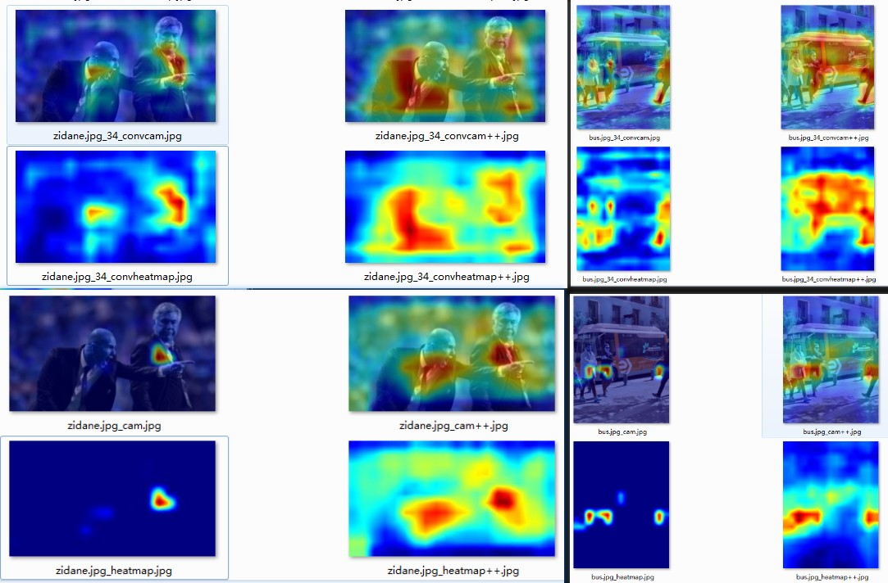
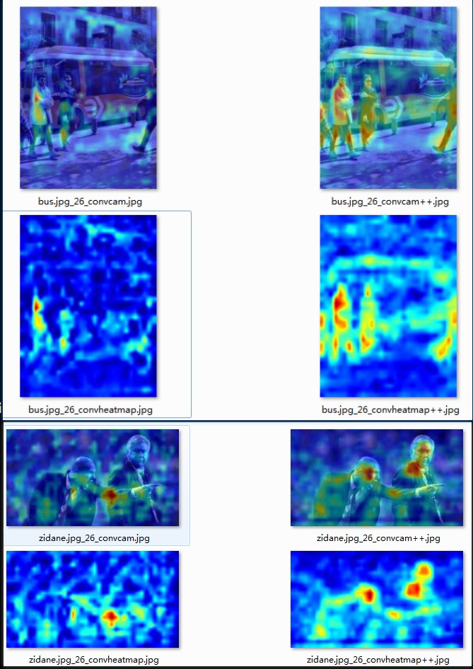

# Grad-CAM or Grad-CAM++ for YOLOV5

Hope see the cam of each layer, Conv or Detect layer

# Thanks
https://github.com/ultralytics/yolov5  
https://github.com/yizt/Grad-CAM.pytorch

# Usage

`python grad_cam.py`

other opts: --classes --device --save-txt --source

# Example

